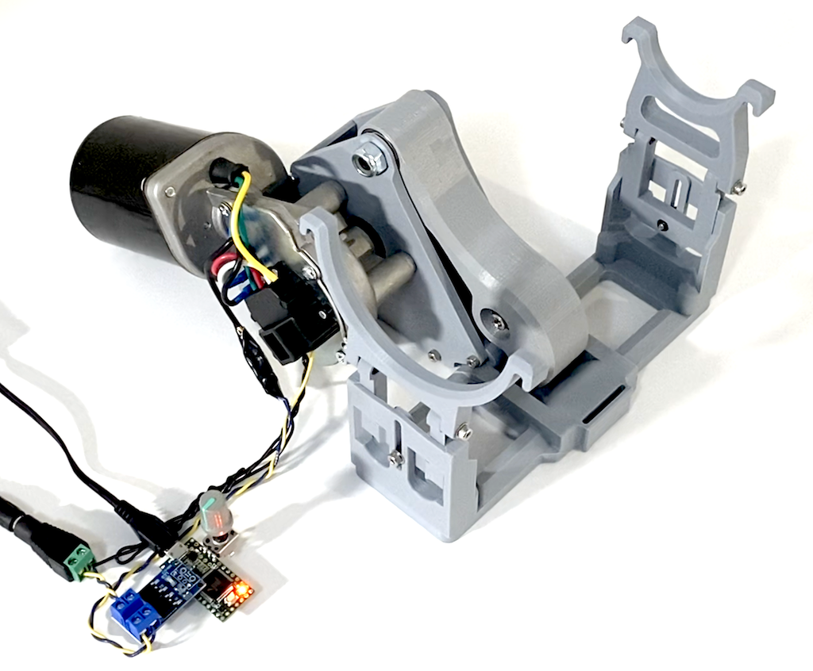
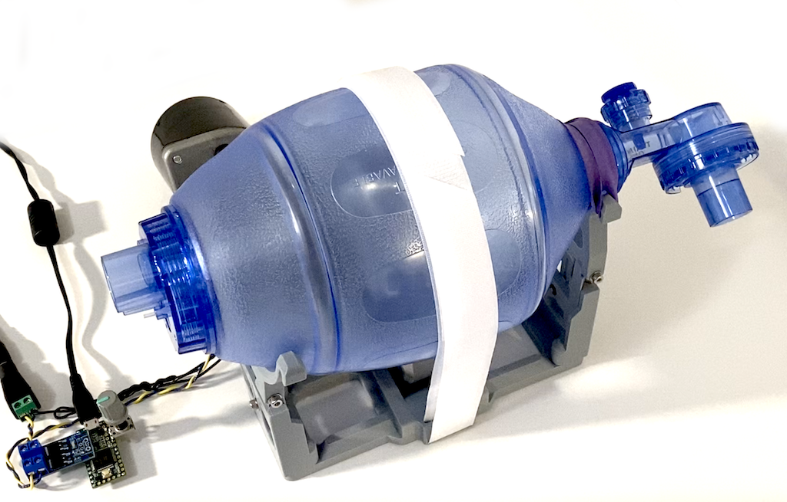
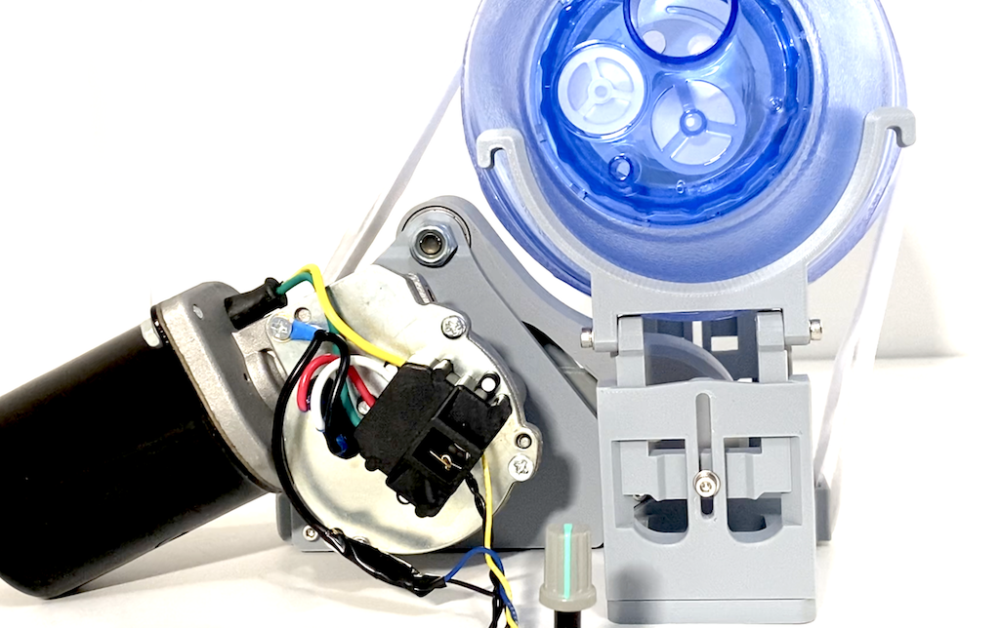
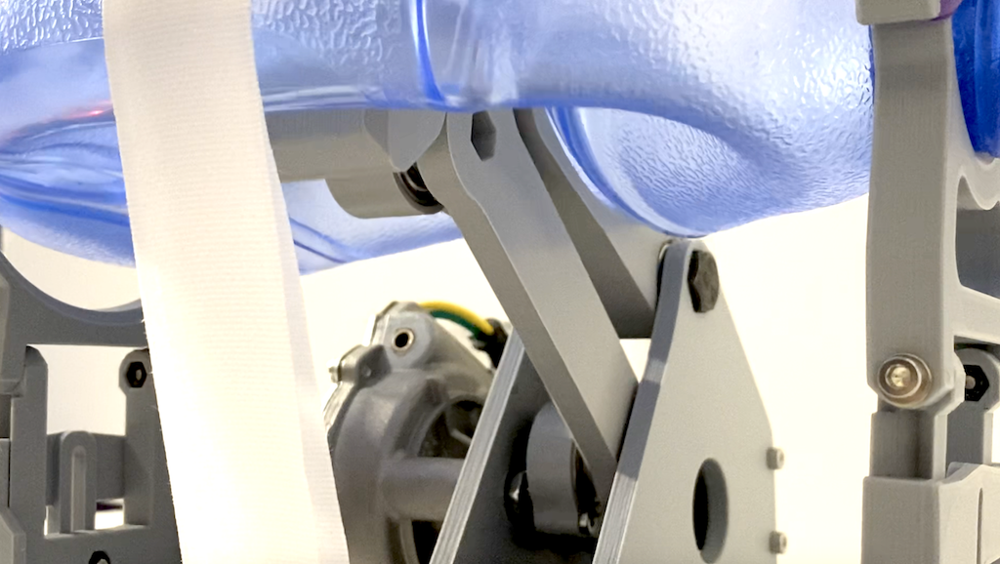
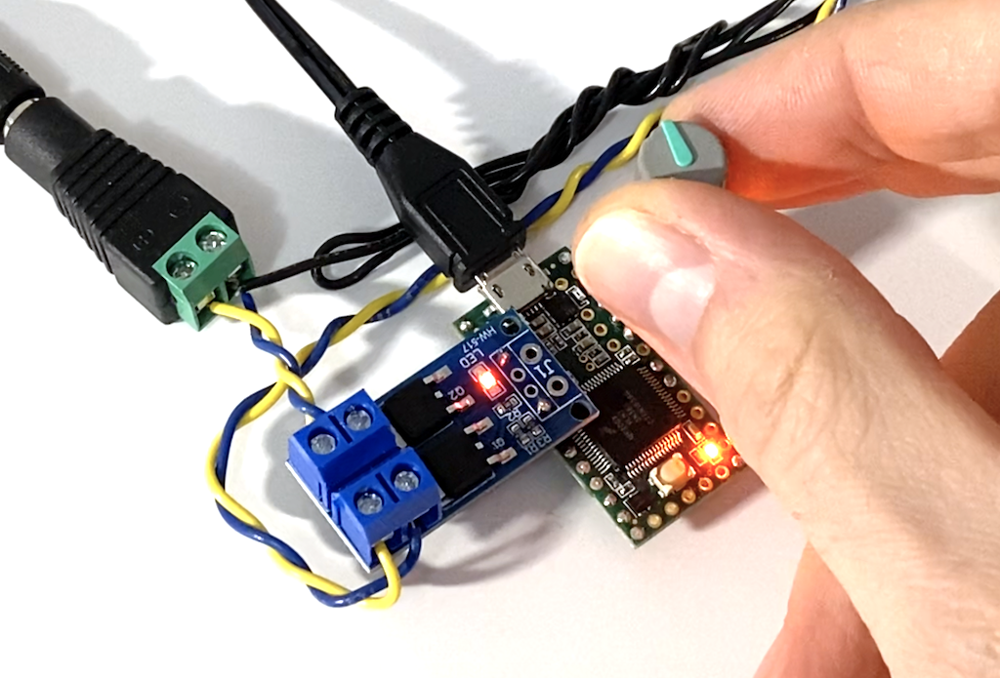
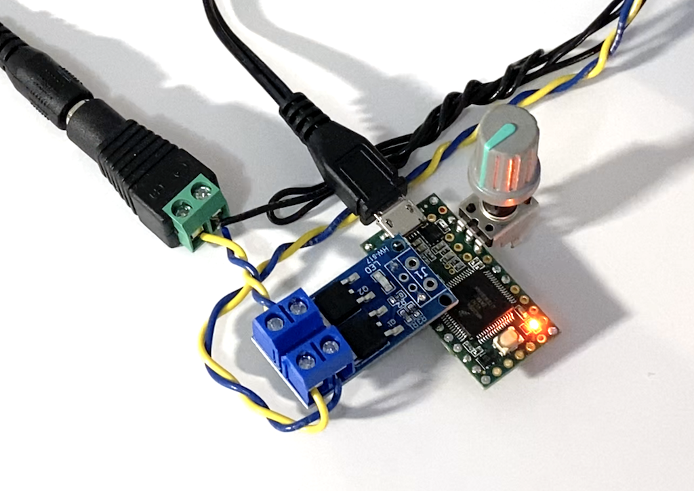

# LRVent: 3D Printed BVM Ventilator

>  [Overview video of LRVent Mk2](https://www.youtube.com/watch?v=VjBAnV-SXSI)

Patients with COVID-19 in serious or critical condition often require assisted breathing via ventilator. As the number of patients in need of ventilators grows (exponentially in many densely populated regions), there are not adequate numbers of ventilators to support the high number of patients.

**This project aims to provide a very basic, last resort ventilator design that can be built quickly with locally sourced parts (from hardware and automotive stores) and maker-level tools (hand tools and a 3D printer).** 

The basic structure of the device is intended to span a large range of parts depending on what can be found locally (various fasteners, motors, and electronics) and can be easily extended to accommodate new components as needed. It is also designed to span a wide range of technical capabilities (from simply plugging in power to a motor, up to Arduino-level software and electronics to add basic controls for breathing rate and inspiratory/expiratory ratio).

As with any medical device hack, this has been created with the intention of being as safe as possible given the harsh constraints of the current global pandemic and ventilator shortage, but is **UNCERTIFIED, HIGHLY EXPERIMENTAL, and UNTESTED ON HUMANS.** As such, any potential use scenario would also require **legal waivers to use uncertified/untested non-medical devices** and **significant additional patient monitoring by medical professionals and certified diagnostic equipment** to reduce the risk of serious consequences in the event that the device fails to operate as intended by doctors. The **core contributors to this project are not medical professionals**.

Also note that lungs are very delicate organs, and **inappropriate use/testing of any ventilator can cause severe trauma to the lungs.** This is intended for medical professionals as a last resort under their professional judgement and supervision in desperate times. **Don't test the device on yourself or your friends. Don't even test it on your dog. You have been warned.** 

LRVent is released as public domain (Creative Commons Zero v1.0 Universal) for anyone to use, modify, share, produce, etc. with no strings attached.

## Disclaimer

This project is aligned with [OpenLung](https://gitlab.com/open-source-ventilator/OpenLung/-/tree/master)'s project goals, and as such carries with it the same umbrella disclaimer.

*The plans, documents and other materials (“Material”) contained on this website are intended to facilitate the design of a prototype reproducible medical device to be used if required during the Covid-19 pandemic. The Material is not itself a medical device. The Material has not been tested and has not been approved for use in humans or animals by any regulatory authority of any country.*

*By using the Material, you are agreeing to the following disclaimer.*

*The project offers the Material as-is and as-available, and makes no representations or warranties of any kind whatever concerning the Material, whether express, implied, statutory, or other. This includes, without limitation, warranties of merchantability, fitness for a particular purpose, non-infringement, absence of latent or other defects, accuracy, or the presence or absence of errors, whether or not known or discoverable.*

*To the extent possible, in no event will the contributors of this project be liable to you on any legal theory (including, without limitation, negligence) or otherwise for any direct, special, indirect, incidental, consequential, punitive, exemplary, or other losses, costs, expenses, or damages arising out of the Material or use of the Material, even if the contributors has been advised of the possibility of such losses, costs, expenses, or damages.*

***Any ventilator system that has not been approved by a competent medical device regulatory authority may not deliver to the user the ability to properly monitor and control tidal volume, inspiratory pressure, inspiratory/expiratory ratio, heart rate, nor provide the user with the ability to monitor and control positive-end expiratory pressure (PEEP), peak inspiratory pressure (PIP) or to adapt to individual patient requirements.  Inability to monitor and/or control any of these factors can cause death or serious permanent injury.***

*The disclaimer of warranties and limitation of liability provided above shall be interpreted in a manner that, to the extent possible, most closely approximates an absolute disclaimer and waiver of all liability.*

## When to consider building/using LRVent

As its name implies, LRVent should be used as a last resort. Generally, medical professionals are likely to consider ventilation in this order:

1. Approved/certified ventilators used as designed on a single patient.
2. Secondary ways to extend resources (such as splitting a single ventilator's output to multiple patients, or refurbishing decommissioned units) or leveraging/modifying other certified devices (such as a BiPAP/CPAP machines).
3. Anything else that medical professionals deem appropriate for the given patient/circumstance.
4. Other more capable quick-build ventilator efforts (OpenLung, quick-turn manufacturing initiatives, etc...).
5. Seriously... anything else that may be medically beneficial.
6. Okay, as a ***very last resort***, this project (LRVent).

## LRVent Approach

Tenets for the LRVent design:

* Leverage **medical equipment that's not in short supply.** 
  * A <u>Bag-Valve-Mask</u> (BVM, used for manual ventilating) is sterile and has standard fittings for various valves and supply lines. BVM are also standard in most hospital/ambulance settings, likely already on-hand, and typically cost less than $50 each.
  * Existing <u>certified and highly-capably monitoring equipment</u> (heart rate, blood oxygen, etc.) are often tightly integrated with broader hospital monitoring/notification systems for critical care. While adding fail-safe monitoring and alerts/lights/buzzers to the LRVent may seem like an important feature, there's a risk of then relying on them to notify staff and this project should in no way be perceived as reliable for life-critical use.
* Leverage **reliable, mass-produced parts where possible.**
  * To repeatedly press on a BVM, a fairly powerful mechanical-electrical actuator is needed that can run constantly for 30+ days. Many automative parts fit nicely into this category, especially <u>windshield wiper motors</u> that have built-in functionality to "park" the wipers after a complete revolution. This can ideally be leveraged to complete a full revolution (a BVM push/return cycle) and then rest until the next breath is desired without needing additional sensors.
  * <u>Standard metric fasteners and bearings</u> that can be found at local hardware stores. US hardware stores often carry metric fasteners as well, but may be located in another area.
* Leverage **broadly accessible, maker-level tools.**
  * <u>Hand tools and a 3D printer</u> should be about all the tools that are needed. Don't assume laser cutters, water jet cutters, CNC machines, lathes, mills, etc. as this greatly limits who can build one. If you have access to a full machine shop and/or trained fabrication staff, consider a more production-centric ventilator project.
  * In terms of printing, while some materials are much tougher than PLA (such as ABS and PETG), LRVent should be designed to be <u>fully functional when printed in PLA</u> since that is what most maker spaces and/or home workshops already have in large supply. 
* Span a **wide range of locally sourced components.**
  * <u>Splitting the design into modular pieces</u> that can fit a wide range of parts enables more people to make devices. For example, various windshield wiper motors have different bolt patterns to attach them to cars, and thus where the motor mounts to LRVent should be a part that can be selected/modified to fit.
* Span a **wide range of skillsets.**
  * A <u>novice maker</u> should be able to buy/print the relevant parts, plug in power, and have the device start pumping. It may be less than optimal, but from there, further hacks (like mechanically spacing the BVM away from the stand to change the tidal/breath volume) could be employed.
  * For <u>more advanced makers</u>, using an additional Arduino-capable microcontroller, a couple FET transistors, a couple potentiometers, and a soldering iron should be enough to quickly build/program a basic controller to allow for adjusting breathing rate and inspiratory/expiratory ratio.
* Always **allow for manual intervention.**
  * The BVM should <u>remain accessible to hand pumping</u> when needed. If the motor stops and medical staff are notified (by other connected devices), a person should be able to immediately begin pumping by hand to continue the supply of air while the issue is resolved. Note that this may be partially at odds with avoiding a "pinch point" where a user could inadvertently place their hand in the device's motor/actuation path and injure themselves (which must be avoided as much as possible), but access to the patient's air supply is given highest priority.
* **Completely open/free for the world.**
  * Released under <u>Creative Commons 0 / Public Domain</u>. No strings attached. If you have ideas for improvement, just do it (then of course feel free to let us know and/or fork the repo and share your changes if you think others may find it useful, too). For your own safety, and the safety of others, please continue to include the disclaimer and be mindful to convey the **UNCERTIFIED, HIGHLY EXPERIMENTAL, and UNTESTED** nature of this project.

## LRVent Operation

Like many bag-squeezer ventilator projects that have come before [[1](https://web.mit.edu/2.75/projects/DMD_2010_Al_Husseini.pdf), [2](http://oedk.rice.edu/Sys/PublicProfile/47585242/1063096), [3](https://gitlab.com/open-source-ventilator/ventilator/OpenLung)], the idea is quite simple; repeatedly squeeze a semi-rigid bag (BVM / Ambu bag) to deliver air to the patient. 

* **Respiratory rate** (*RR*) is controlled by how often/quickly the bag is squeezed. This is typically set in the range of 8-16 breaths/min, but with COVID-19 patients, using a slightly faster breathing rate (*RR* between 12-20 breaths/min) with less volume seems preferable/likely.
* **Tidal volume** (*Vt*, the amount of air per breath) is controlled how far the bag is squeezed. This is typically set in the range of 350-450mL, but with COVID-19 patients, using a slightly faster breathing rate at lower a *Vt* seems preferable/likely (closer to 200-300mL).
* **Inspiratory/Expiratory ratio** (*Ip/Ep*) is controlled by speed changes between the squeeze and the release portion of each breath.
* **Fraction of inspired oxygen** (*FiO2*) controlled by air/oxygen mix supplied to the BVM's port.

In its **<u>simplest form</u>**: 

* a motor can be driven directly from a power supply (ideally at a voltage that produces squeezing at a typical **Respiratory Rate**; a variable voltage supply is greatly helpful here).
* The **Inspiratory/Expiratory Ratio** is determined by a constant turning speed of the motor (approx. 50%).
* The **Tidal Volume** is set by the placement of the bag relative to the pusher arm. Placing the bag closer engages the pusher for the whole stroke and delivers a larger volume of air. Placing the bag farther from the pusher reduces the volume that is delivered to the patient.

As an **<u>extension</u>** to the simplest form, a **<u>controller can be added</u>**, along with some basic electronics, to more precisely adjust the breathing rate and inspiratory/expiratory ratio from a fixed voltage power supply:

* The voltage driving the motor can be modulated to vary the rate of motion throughout a breath cycle, allowing for the **coarse adjustment of Inspiratory/Expiratory Ratio**.
* By using the windshield wiper motor's "park" functionality, the controller can also more **precisely set the Respiratory Rate**, allowing for a rest/null portion of the breath.
* The **Tidal Volume** is still set mechanically by changing the position/proximity of the bag to the pusher arm.

## Parts List

In addition to the 3D printed parts (in the `PrintFiles` directory), you'll need a few other things:

* **1 x Windshield Wiper Motor**. You can use pretty much any wiper motor, but you'll need to modify the design to properly hold the motor in place and attach to the *WiperArm*. 

  So far, wiper motors for these vehicles have been implemented/tested:

  * **Dodge Ram (1997-1999)**: *Cardone 85-3000*, *Cardone 40-3000*, or similar.
  * more to come as parts are tested...

* **4 x 608 Ball Bearings**: #608ZZ, #6082RS, or similar.

* **4 x M3x(5-8mm long) socket head bolts**: These hold the bearings in place. 

* **24 x M3x(12-15mm long) socket head bolts**: These are used to fasten all of the 3D printed parts together.

* **6 x M3 Locknuts:** These secure the adjustment posts that hold the BVM at a specific height.

* **6 x M3 Washers**: These are used under the head of the bolts with locknuts to spread out the force when tightened.

* **1 x M8x(40-45mm long) hex head bolt**: This provides the primary fulcrum/shaft for the pusher arm.

* **1 x M8 Locknut**: This holds the M8 bolt in place.

* **2 x M5x(15-20mm long) socket head bolts**: These are used in the center/shafts of the pusher arm linkages to secures the bearings to the driven parts.

* **2 x M5 Locknuts**: These hold the M5 bolts in place.

* **1" wide sew-on velcro nylon strap**: This wraps over the top and secures the BVM in place.

* **1 x Heavy Duty Rubber Band**: This holds the neck of the BVM in place so it doesn't drift as the devices runs.

* **1 x Bag-Valve-Mask for testing**: You may be able to find a CPR training BVM which should also work.

## Mechanical Assembly

Note: This design leverages the ability for printed parts to include self-tapping holes (using a bolt directly without pre-cut threads). This seems to work quite well, but **take care not to over-tighten bolts into 3D printed parts** to reduce the risk of stripping the plastic.

1. To assemble the LRVent, start by bolting together the *FrameSideWM_xyz* (specific to the wiper motor you are using) to the *FrameBack* and the *FrameBase* with 5 x M3x(12-15mm long) bolts.
2. Next, bolt on the Wiper Motor to the *FrameSideWM_xyz* with the motor's supplied fasteners.
3. Press a 608 bearing into the *WiperArm*, and secure in place with 2 x M3x(5-8mm) bolts.
4. Press 3 x 608 bearings into the *PusherArm*. Secure the single bearing near the pushing end with 2 x M3x(5-8mm) bolts.
5. Use an M5x(15-20mm long) bolt and M5 locknut to secure the *PushLink* to the *PusherArm*. Note that the *PusherArm* is symmetric.
6. Use an M5x(15-20mm long) bolt and M5 locknut to secure the *PushLink* to the *WiperArm*.
7. If you are planning to add a controller (for more precisely controlling the breathing rate), make sure that the wiper motor is in the home/resting position. You may need to power it on and detect when the switch activates. See your wiper motor's wiring instructions for more info.
8. Holding the *PusherArm* and *PushLink* assembly out of the way, bolt the *WiperArm* onto the wiper motor with its supplied hardware. Tighten it until the entire *PusherArm* assembly is roughly centered in the *FrameBase*. Be careful not to over-tighten as this can cause the shaft of the wiper motor to interfere as it rotates.
9. Bolt on the *FrameSidePassive* to the *FrameBase* and *FrameBack* using 5 x M3x(12-15mm long) bolts.
10. Align the two bearings at the pivot of the *PusherArm* with the top hole of the frame sides. Insert the M8x(40-45mm long) bolt into the top hole (starting from the *FrameSidePassive*). Use the two *M8Washer_1mm* spacers between the *PusherArm* and the two sides. Add the M8 locknut to secure the M8 bolt in place.
11. Being careful not to pinch yourself, you should now be able to fully test the wiper motor and pusher assembly. Powering the motor should produce a smooth motion of the *PusherArm* without any interference or binding.
12. Now assemble the two stands that the BVM will rest upon. For each side, slide the *StandBVMTailTop* into the *StandBVMTailBot* and use an M3x(12-15mm) bolt with an M3 washer under the head and fasten it to an M3 locknut (which should press into the pocked on the back side of *StandBVMTailBot*).
13. For each side, attach either the *StandBVMTailHoldBase* or *StandBVMTailHoldNeck* using 2 x M3x(12-15mm) bolt with an M3 washer under the head and fasten it to an M3 locknut from the sides. Tighten until the holders will hold their position but can still be adjusted with a firm push.
14. Make a 1" wide velcro strap to hold the BVM in place as desired. This gets threaded through the two slots on either end of the *FrameBase* to hold the BVM in place and provide counter-pressure as the *PusherArm* pressed on it.
15. To test the LRVent:
    1. Place a BVM into the holders.
    2. Use a heavy duty rubber band to hold the neck of the BVM in place.
    3. Fasten the velcro strap so that it firmly hold the BVM.
    4. Make sure hands are clear of any moving parts.
    5. Apply power to the motor and ensure the LRVent is operating as expected.

## Electrical Assembly

### Approximate Breathing Rate (simplest)

The simplest way to drive the LRVent's windshield wiper motor is with a voltage controlled power supply (for example, search for "dc variable power supply" on Amazon). While most wiper motors are specified for 12 Volt operation, they can be driven with a lower voltage to decrease the output speed.

Driving the wiper motor without precise timing means that the respiration rate will be approximate and may vary over time (as the motor warms up, as a patient's condition evolves, etc.). Using a controller (see below) greatly improves the timing and can be run from a fixed voltage supply, but does require a bit of soldering and programming to hook everything together.

There are thousands of wiper motors, and the exact specifications of the motor you choose may have different needs than those already tested with this project. Ideally, **if powering LRVent directly, use a controlled DC supply to allow for quick adjustment**. 

But in general, **a 4 to 8 Volt supply (with the ability to supply at least 3 Amps of current) should be adequate**. Since there are many 5Volt (3Amp+) supplies for USB charging, you may want to start there. Note that most wiper motors have a High and Low connection that can offer two speeds using the same supply voltage.

### Controlled Breathing Rate (more complex)

Using a minimal set of maker-level electronics (an Arduino and some basic soldering), the breathing rate of the LRVent can be more precisely controlled. 

The electronics, interface, and programming logic could all be greatly expanded upon to produce a more robust and fail-safe device, but this project will focus on the baseline set of components needed to control the breathing rate. Since LRVent already assumes the patient will be closely monitored by medical professionals and other automated medical equipment, the goal is to provide a functional system with the least amount of secondary features that could potentially introduce programming/wiring bugs or make it more complicated to operate/adjust by a doctor.

The **primary electrical components** needed to allow for a controlled breathing rate are:

* An Arduino-capable microcontroller (Arduino, Teensy, Metro, ESP32, etc.).
* A potentiometer/knob (to allow the user to adjust the breathing rate).
* A simple high-current motor driver (like a basic high-power FET, or half of an H-Bridge).

Ideally, the wiper motor's integrated switch could be sensed by the microcontroller to know precisely when the motor is in the "home" position after each complete breath, but the switch on the motor can be very noisy and (from experience) **the switch can sometimes produce voltage spikes as the motor is powered which can burn out the microcontroller**. 

As such, it seems preferable to use the integrated wiper switch as a momentary pass-through to allow the motor to continue running until it reaches the home position (at which point it will pause until briefly powered by the microcontroller). By using the microcontroller as a basic controllable timer, there's less room for coding error or a false sense of security. The LRVent is a last resort and functionally basic -- medical personnel should closely monitor the patient at all times and assume it could stop working without notice. It is a windshield wiper motor after all.

**The wiring is very basic:**

* Solder the leads of the potentiometer to the microcontroller (making sure it is connected to an analog input / ADC).
* Solder the FET/Motor driver to an output on the microcontroller.
  * Note if using a FET:  since the wiper motor will likely need a higher voltage than the microcontroller (12V compared to 3.3V or 5V), it is easiest to control the Ground/negative side of the motor's power instead of the positive side. That means that the motor can be directly powered from the positive side of the voltage supply, and the ground lead can be interrupted/controlled by the microcontroller. The wiper motor's integrated switch can then be connected such that ground is supplied to the motor (this completing the circuit to keep it going) when the motor is not in the "home" position.

## Programming 

If using a microcontroller to precisely control the breathing rate of the LRVent, you'll need to program it with some basic code that reads the knob and updates the interval for driving the wiper motor.

The `Arduino` directory contains example code for programming an Arduino-capable board. 

* Open the appropriate `.ino` file in the Arduino code editor.
* Make any modifications to the code (make sure you set the constants such as  `PIN_WIPER_MOTOR_FET_PWM_OUTPUT` to the correct values for your board and attached circuitry).
* Connect/select your board and serial port.
* Click Upload.

Like all aspects of the LRVent project, the software is a best effort, but it is in no way certified for use as a medical device. Use at your own risk. In no event will the contributors of this project be liable.